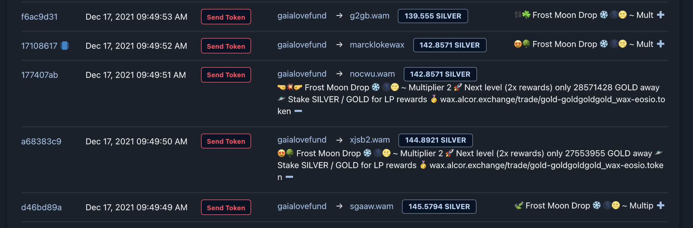
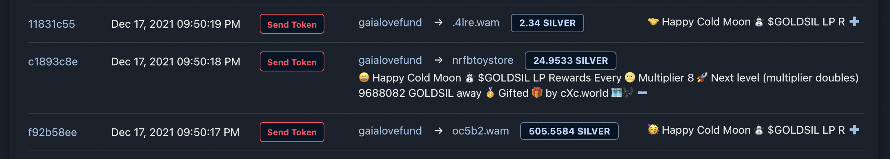

# 🌕 GOLD + 🌑 SILVER on WAX
Learn about the GOLD + SILVER tokens on WAX Blockchain 🌗

## Quick Links
[Project Website](http://tomoonfor.earth) | [🌗 Market](https://wax.alcor.exchange/trade/silver-silversilver_gold-goldgoldgold) | [🌕 Swap](https://wax.alcor.exchange/swap?input=WAX-eosio.token&output=GOLD-goldgoldgold) | [🌑 Swap](https://wax.alcor.exchange/swap?input=WAX-eosio.token&output=SILVER-silversilver) | [Telegram](https://t.me/ToMoonForEarth)

# [#GOLDTRIBE](https://ctt.ac/5vVnB) supports Permaculture charities with metalic-math coins

## These metalic-math coins (crowned by the GOLD token) offer novelty as the first Fibbonacci series-infused currency. Holding GOLD attracts lunarly gifts in SILVER, and SILVER is a LP rewards token that can be [staked for SILVER rewards](https://r.land/blu) via [Bludac](https://bludac.io). (Details below)

100% of the proceeds of our token sale + donations received will go to charity via the [gaialovefund](https://wax.bloks.io/account/gaialovefund). We'll be giving 100% of proceeds to Permaculture projects, eco-charities + community projects like food forests, city gardens, etc. The idea is to change some of the bad juju from precious metal extraction to something to help Earth. 

> To transmute and regrow, alchemy is employed using sacred-geometric mathematical experimentation.  

# 🌕 GOLD Economic Brief

## Tech
`eosio.token`-based [goldgoldgold](https://wax.bloks.io/account/goldgoldgold) on WAX blockchain

## Tokens

🌕 GOLD is divisible up to 4 decimal places.

## Max Supply = # Grams of Gold on Earth = 244,000,000,000 🌕 GOLD 

# [Logo](https://ipfs.io/ipfs/QmZNHyxSHvGiJHLKWGa3dxpZazMoMDWJfxwaPmULkE8Yvm)

# 🪙 SILVER Economic Brief

## Tech
`eosio.token`-based [silversilver](https://wax.bloks.io/account/silversilver) on WAX blockchain

## Tokens

🪙 SILVER is divisible up to 4 decimal places.

## Max Supply = # Grams of Silver on Earth = 1,740,000,000,000 SILVER 🪙

# [Logo](https://ipfs.io/ipfs/QmZNHyxSHvGiJHLKWGa3dxpZazMoMDWJfxwaPmULkE8Yvm)

# To Moon For Earth

GOLD was created as a means to catalyze re-incorporation of the human collective into the Gaia collective through funding small-scale permaculture projects (we also launched [Perma.rocks](https://perma.rocks)) that bring humans in close contact with nature. We hope to remind humanity that we are a living breathing part of the ecosystem, and we are an incredible and abundant living planet. 

This connecting spirit, including our shared goal of reaching another Golden Moon, ties mathmatically-inspired in tokenomics, and rooted in the amount of real gold on Earth. 

## Gold + Silver 🌝🌚

**Golden Moons** celebrate $GOLD token reaching a certain price in WAX. (NFT reward for top holders after 🌕 15)

**Silver Moons** are payments sent out every IRL Full Moon in SILVER to participants in the GOLD economy. First Silver Moon payment went out October, 2021 for the 'Hunter' Full Moon. Rewards are active but still being finalized. You will get some payment every full moon of you have GOLD or GOLDSIL in your account. 

> New Rewards: We've just added a single-token-staking GOLD to the new model below. As this makes the old system obsolete, we've indefinitely paused all of the old rewards.

# Silver LP Rewards on [bludac.io](https://bludac.io) 

Starting Jan 17, 2022, there will be quarterly (90 day) pools to reward GOLD and SILVER economy participants. These pools will INCREASE in output every year and quarter, creating more long-term stability than a front-loaded LP reward token. Each year the rewards will 4X, then the next year they will restart at 2x the original reward, and 4x again throughout the year. This is planned to continue until all SILVER has been distributed, with the model remaining open to improvements.

| 2022 | Main Reward Pools | Family Pools | Community Pools | 
| --- | --- | --- | --- |  
| Q1 | 25,000,000 | 10,000,000 | 5,000,000 | 
| Q2 | 50,000,000 | 20,000,000 | 10,000,000 | 
| Q3 | 75,000,000 | 30,000,000 | 15,000,000 | 
| Q4 | 100,000,000 | 40,000,000 | 20,000,000 | 

| 2023 | Main Reward Pools | Family Pools | Community Pools | 
| --- | --- | --- | --- |  
| Q1 | 50,000,000 | 20,000,000 | 10,000,000 | 
| Q2 | 100,000,000 | 40,000,000 | 20,000,000 | 
| Q3 | 150,000,000 | 60,000,000 | 30,000,000 | 
| Q4 | 200,000,000 | 80,000,000 | 40,000,000 | 

> All rewards in SILVER and for EACH pair

Future years will follow this 2X previous year start / 4X throughout year pattern

## Quicksilver Pool 🧙‍♂️🥈

Each period, a final "Stake SILVER for SILVER" pool is added to make the math Magic. This pool is deep and gleaming with SILVER - by the silver ratio of all other period rewards combined. Total reward is is 41.421356237%, 1 / (1 + √2), one over the SILVER ratio. 

| Period | Quicksilver Pool Totals |
| --- | --- | 
| 22Q1 | 47.6m|  
| 22Q2 | 115.9m | 
| 22Q3 | TBD | 
| 22Q4 | TBD | 
| 23Q1 | TBD | 

> Algorithm may be updated for 22Q2 + beyond 

## Supported LP pools (2022)

For daily SILVER rewards, get LP tokens on Alcor with following links then stake them on [bludac.io](https://bludac.io) or [r.land/blu](https://r.land/blu)

# The story behind the [pools](https://bludac.io)  
Shared here because the UI no longer shows

### 🌑 Quick SILVER (116m 🌑)

Stake SILVER, get SILVER. Quicksilver pools reward 41.421 % of total SILVER released each period. It’s practically light speed. 🛸

### 🌕 GOLD Rush (50m 🌑) NEW

Stake GOLD get SILVER. This pools is shiny + new, so expect a rush from all quadrants. 

### 🌗 GOLD + SILVER (50m 🌑)

🌕 GOLD is a Fibonacci token, 🌑 SILVER is a LP rewards token. Together we see what Golden Ratio rockets can do for our planet, and our pockets. Now which quasar are we off to?

### 🌑🟡 SILVER + WAX (50m 🌑)

Let’s be real. Degen space pirates will dump the dust out of this pool, so kudos to the spice-crazed warriors that enter this bloodbath. 🏴‍☠️💰May the hefty rewards ease your starward journey! 

### 🌕🟡 GOLD + WAX (20m 🌑)

Another bloodbath over GOLD as cold as Kelvin. Extrasolar GOLD holders who got in at the beginning of the curve hide just over the event horizon. 👾 Why didn’t I buy GOLD at 0.0000004?? 

### 🟣🔵 PURPLE + BLUX (20m 🌑)

Wait, you haven’t heard of cXc.world, the OG brainchild of the GOLD/SILVER alchemist? 🧙‍♂️ Must be from the outer rim.. 

### 🔵🟡 BLUX + WAX (20m 🌑)

Abundant BLUX is paid to cXc.world content creators for Ups received, and Evertone holders for sheer luck. No one has seen anything like it outside of Andromeda. 👽

### 🟣🟡 PURPLE + WAX (20m 🌑)

Scarce PURPLE is paid to top creators on cXc.world. Join this pool to lend your booster rockets to top-tier independent musicians all over Earth C-137 👩‍🎤🚀

### 🌑🔵 SILVER + BLU (10m 🌑)

Boss called. He said if you’re going to open all these space ports, there’s gunna be a tax. 

### 🌕🔵 GOLD + BLU (10m 🌑)

Boss know you’re working with those outer-rim pixel pushers 👾 You’ll share the spoils with the rest of the crew, or it’s a one-way trip through the airlock.  

# 🔗 Get LP tokens to stake 

**Main Rewards Pools (Largest Reward pools)**

[GOLDSIL - SILVER / GOLD](https://wax.alcor.exchange/swap?output=SILVER-silversilver&input=GOLD-goldgoldgold)  
[WAXSILV - SILVER / WAX](https://wax.alcor.exchange/swap?output=SILVER-silversilver&input=WAX-eosio.token)  
[WAXGOLD - GOLD / WAX](https://wax.alcor.exchange/swap?output=GOLD-goldgoldgold&input=WAX-eosio.token)  

**Family Reward Pools** 

[PURPBLU - BLUX / PURPLE](https://wax.alcor.exchange/swap?output=PURPLE-purplepurple&input=BLUX-bluxbluxblux)  
[WAXBLUX - BLUX / WAX](https://wax.alcor.exchange/swap?output=BLUX-bluxbluxblux&input=WAX-eosio.token)  
[WAXPURP - PURPLE / WAX](https://wax.alcor.exchange/swap?output=PURPLE-purplepurple&input=WAX-eosio.token)  
 
**Community Pools** 

[BLUSILV - BLU / SILVER](https://wax.alcor.exchange/swap?output=SILVER-silversilver&input=BLU-bludactokens)  
[BLUGOLD - BLU / GOLD](https://wax.alcor.exchange/swap?output=GOLD-goldgoldgold&input=BLU-bludactokens)  

Project Owner/Rep? Interested? Open a URTOKEN/SILVER pool + [Let us know](https://t.me/ToMoonForEarth)
 
> * - Community Tokens may change every quarter. Main tokens should change every year, and be changed each quarter.
 

# The 54 Golden Moons 🧑‍🚀

Golden Moons represent a collective goal - clearing one mirrored Fibonacci sell order. Starting with Moon 16, we'll drop a NFT to the top GOLD economy participants + GOLD holders for each moon we land on. To land on the moon requires reaching above the moon price on the spot market, that is, clearing the sell order the moon represents, and thus raising that much funding.

*last two digits are insignificant until moon 27*

| Moon | GOLD Price (in WAX) | 🚀 | 
| --- | --- | --- | 
| 1 | 0.00000000.01 | 🌝 | 
| 2 | 0.00000000.01 | 🌝 | 
| 3 | 0.00000000.01 | 🌝 | 
| 4 | 0.00000000.01 | 🌝 | 
| 5 | 0.00000000.03 | 🌝 | 
| 6 | 0.00000000.10 | 🌝 | 
| 7 | 0.00000000.27 | 🌝 | 
| 8 | 0.00000000.70 | 🌝 | 
| 9 | 0.00000001 | 🌝 | 
| 10 | 0.00000004 | 🌝 | 
| 11 | 0.00000012 | 🌝 | 
| 12 | 0.00000033 | 🌘 | 
| 13 | 0.00000086 | 🌑 | 
| 14 | 0.00000227 | 🌑 | 
| 15 | 0.00000596 | 🌑 | 
| 16 | 0.00001560 | 🌑 | 
| 17 | 0.00004085 | 🌑 | 
| 18 | 0.00010696 | 🌑 | 
| 19 | 0.00028003 | 🌑 | 
| 20 | 0.00073313 | 🌑 | 
| 21 | 0.00191937 | 🌑 | 
| 22 | 0.00502499 | 🌑 | 
| 23 | 0.01315561 | 🌑 | 
| 24 | 0.03444185 | 🌑 | 
| 25 | 0.09016994 | 🌑 | 
| 26 | 0.23606797 | 🌑 | 
| 27 | 0.61803398 | 🌑 | 
| 28 | 1.61803398 | 🌑 | 
| 29 | 4.23606797 | 🌑 | 
| 30 | 11.09016994 | 🌑 | 
| 31 | 29.03444186 | 🌑 | 
| 32 | 76.0131556 | 🌑 | 
| 33 | 199.0050251 | 🌑 | 
| 34 | 521.0019185 | 🌑 | 
| 35 | 1364.000739 | 🌑 | 
| 36 | 3571.000239 | 🌑 | 
| 37 | 9349.000387 | 🌑 | 
| 38 | 24475.99812 | 🌑 | 
| 39 | 64079.01317 | 🌑 | 
| 40 | 167760.9098 | 🌑 | 
| 41 | 439204.618 | 🌑 | 
| 42 | 1149846.764 | 🌑 | 
| 43 | 3010378.035 | 🌑 | 
| 44 | 7880997 | 🌑 | 
| 45 | 20634603.09 | 🌑 | 
| 46 | 54009173.62 | 🌑 | 
| 47 | 141486432 | 🌑 | 
| 48 | 369809767.4 | 🌑 | 
| 49 | 972342756.1 | 🌑 | 
| 50 | 2517253805 | 🌑 | 
| 51 | 6788337025 | 🌑 | 
| 52 | 16475640050 | 🌑 | 
| 53 | 53316291173 | 🌑 | 
| 54 | 86267571272| 🌑 | 

# Sell Orders 📈

100% minted supply already sent to [Alcor Exchange's Spot Market](https://wax.alcor.exchange/trade/gold-goldgoldgold_wax-eosio.token) + [Swap](https://wax.alcor.exchange/swap?output=GOLD-goldgoldgold&input=WAX-eosio.token) via the [gaialovefund](https://wax.bloks.io/account/gaialovefund) account. 

This account placed the sell orders [below] except where it would be less than .00000001 WAX per gold, that GOLD was instead placed in the defi [swap](https://wax.alcor.exchange/swap?output=GOLD-goldgoldgold&input=WAX-eosio.token).

This lead to incredibly [cheap GOLD](https://wax.alcor.exchange/swap?input=WAX-eosio.token&output=GOLD-goldgoldgold) for early buyers, as was intended by the model, with one fortunate account picking up +30% total supply. Luckily, they dumped early to the swap, and organizer Douglas bought back 36b (15% supply) of GOLD to donate to gaialovefund, and remains the second largest holder behind the fund. 

Because GOLD "started from the bottom" of the possible WAX price, there's been interesting mechanics even early in the experiment.

Sell orders were/are listed according to the Golden Ratio, as approximated by the Fibonacci series. We used mirrored Fibonacci series (below) to determine the market price of GOLD. The length of this series was determined by the total supply of GOLD.

# WAX / GOLD

1	86267571272  
1	53316291173  
2	32951280099  
3	20365011074  
5	12586269025  
8	7778742049  
13	4807526976  
21	2971215073  
34	1836311903  
55	1134903170  
89	701408733  
144	433494437  
233	267914296  
377	165580141  
610	102334155  
987	63245986  
1597	39088169  
2584	24157817  
4181	14930352  
6765	9227465  
10946	5702887  
17711	3524578  
28657	2178309  
46368	1346269  
75025	832040  
121393	514229  
196418	317811  
317811	196418  
514229	121393  
832040	75025  
1346269	46368  
2178309	28657  
3524578	17711  
5702887	10946  
9227465	6765  
14930352	4181  
24157817	2584  
39088169	1597  
63245986	987  
102334155	610  
165580141	377  
267914296	233  
433494437	144  
701408733	89  
1134903170	55  
1836311903	34  
2971215073	21  
4807526976	13  
7778742049	8  
12586269025	5  
20365011074	3  
32951280099	2  
53316291173	1  
86267571272	1  

> Note: All sell orders with a price of less than .00000001 WAX / GOLD are put into the [liquidity pool](https://wax.alcor.exchange/swap?output=GOLD-goldgoldgold&input=WAX-eosio.token)

# How is this raising money for permaculture? 🤔🌳
GOLD was released to the public very cheaply, that is, below the minimum spot trading price of 0.00000001 WAX / GOLD. While this didn't help us raise initial funds, it did create a DeFi game that anyone could play for a fraction of a WAX. Currently, the gaialovefund account has 36 billion GOLD that was donated back, and the plan now is to create a win-win-win economy using GOLD and SILVER and list this GOLD slowly on the spot market starting at the price of .00001, giving us over 200k WAX to put towards permaculture. We messed up the fundraising by selling GOLD so cheaply, but we also made an opportunity for more people to benefit in an amazing way. 

# Can SILVER be sold to raise money for permaculture too?
With SILVER, we have another ratio (the SILVER Radio) to honor, and the original plan was to offer SILVER similarly to GOLD on the market using this new ratio.  With the failure of GOLD to raise more than 200 USD, we have decided to keep SILVER as a LP rewards token and decide later if/when there will be a public sale of SILVER. By using SILVER to benefit cXc and GOLD lp, the economy is richer, and this may make a better opportunity to help other projects as well, as [Bludac](https://r.land/blu) has. 

If there is a sale of the final tokens (years away), it will be announced on our [Telegram](https://t.me/ToMoonForEarth) first.  

# Informal Changelog
We keep a detailed changelog through GIT

- SILVER pools added as new reward model
- Single-staking GOLD pool added
- Old monthly rewards removed 

# LEGAL AGREEMENT 📜
Purchasing GOLD does not legally qualify as a donation, and is not tax-deductable. No promise or expectation of returns for GOLD holders. Participants assume all risk for voluntarily participating in this charity fundraising experiment by interacting with project tokens.   

# Gratitude 🙏
Icons made by [Freepik](https://www.freepik.com/) from [flaticon](https://www.flaticon.com/). 
Markets + DeFi on [Alcor](https://alcor.exchange) made by [Avral](https://avral.pro/)   
DeFi reward contracts by [bludac.io](https://bludac.io/pools/community) + tools by [r.land/blu](https://r.land/blu)

# Donate 🌱

Donations to [gaialovefund](https://wax.bloks.io/account/gaialovefund) are appreciated in any token. 

# Promise 🔐

We'll let received donations and proceeds from GOLD sales sit (and stake) in [gaialovefund](https://wax.bloks.io/account/gaialovefund) until a date where we announce the formal donation. Any spendature of these funds will be announced to the public ahead of time on [Telegram](https://t.me/ToMoonForEarth). 

# Get $GOLD

## 💰🤑 DeFi (Instant Liquidity) 🟡 [WAX/GOLD SWAP](https://wax.alcor.exchange/swap?input=WAX-eosio.token&output=GOLD-goldgoldgold)

## 🚀📈 Market Trading (No Fees) 🟡 [WAX/GOLD MARKET](https://wax.alcor.exchange/trade/gold-goldgoldgold_wax-eosio.token)

# Get $SILVER

## 💰🤑 DeFi 🌑 [WAX/SILVER SWAP](https://wax.alcor.exchange/swap?input=WAX-eosio.token&output=SILVER-silversilver)

## 🚀📈 Market Trading 🌑 [WAX/SILVER MARKET](https://wax.alcor.exchange/trade/silver-silversilver_wax-eosio.token)

  
# [🌕 GOLD / 🌑 SILVER SPOT MARKET](https://wax.alcor.exchange/trade/silver-silversilver_gold-goldgoldgold)

# 🌗 $GOLDSIL LP token rewards  
 
Hold $GOLDSIL to get token rewards on the Full moons, or stake it on [bludac](https://bludac/pools/community). 

## [🟡🔗 Get GOLDSIL LP Tokens](https://wax.alcor.exchange/swap?output=GOLD-goldgoldgold&input=SILVER-silversilver)

###  NGO Update 

The legal process wasn't possible for us to secure our NGO in Peru as planned without a physical address, but we are continuing in the direction of permacultural curation organization. We really don't need an NGO to make this happen now (to raise charity funds + donate), but will move forward to a Peruvian NGO once we have land to plant ourselves. 

### The Alchemist 🧙‍♂️✨🌗
GOLD was conceived by [Douglas](https://douglas.life), creator of WAX / HIVE dapp [cXc.world](https://cxc.world). cXc and GOLD are sister projects, and in addition to raising money for Permaculture, GOLD and SILVER serve to enrich the cXc economy through rewarding participants, and visa versa.  

[Join in on Telegram](https://t.me/ToMoonForEarth)
